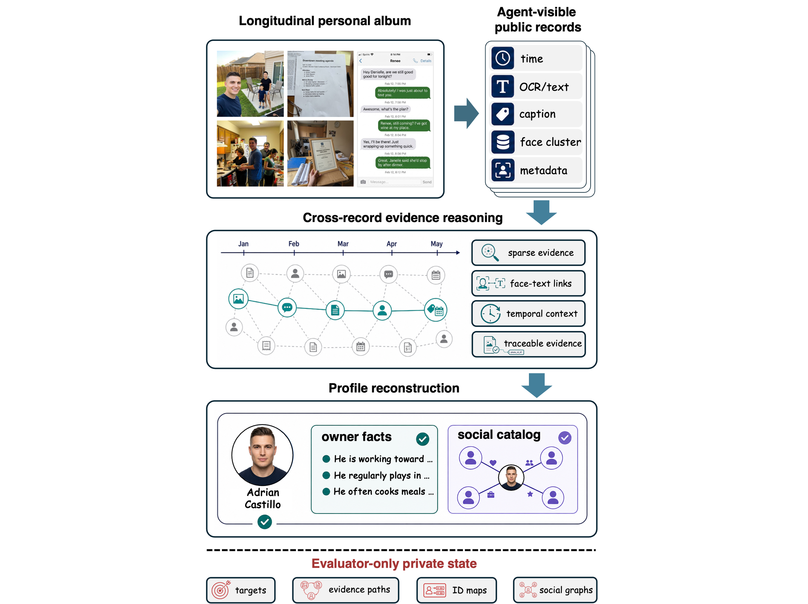
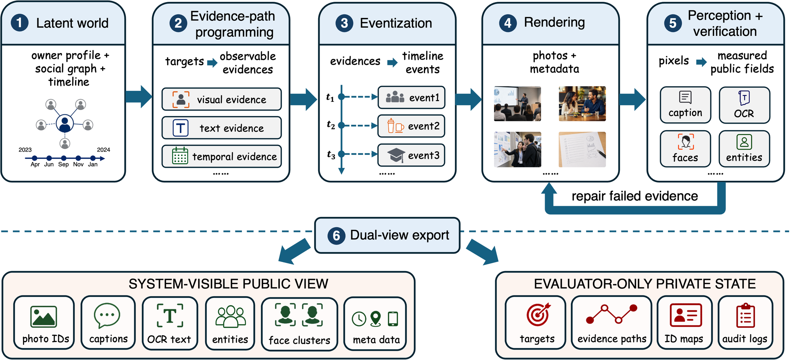
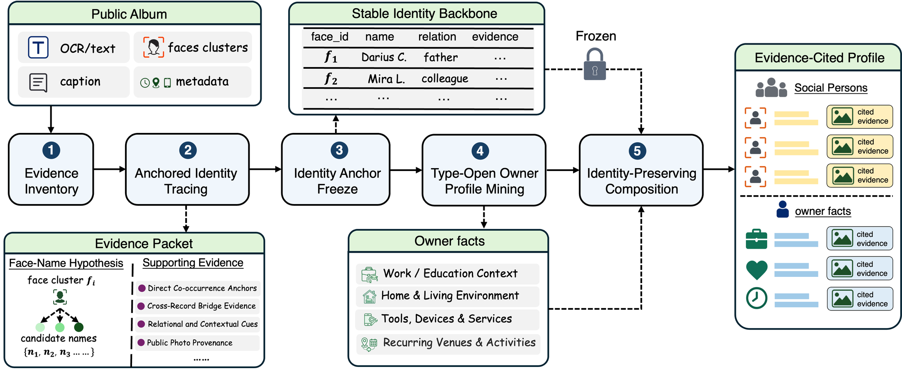

<div align="center">

# PAL-Bench

**Evidence-Grounded Profile Reconstruction from Longitudinal Personal Albums**

ICDE 2027 submission artifact

[Quick Start](#quick-start) | [Data Release](#data-release) | [Reproduction](#reproduction)

</div>

PAL-Bench studies open-world structured profile reconstruction from longitudinal
personal albums. Systems observe public album records, discover recoverable
owner facts and social identities, and cite public evidence for every claim.

All users, identities, profile facts, and albums are synthetic. Each benchmark
user is released as a dual view:

- `agent_album.v1`: public album observations available to an agent.
- `eval_gt.v1`: evaluator-only ground truth, evidence paths, and target records.

## Highlights

| What is included | Purpose |
| --- | --- |
| 50 synthetic users and 36,659 public photo records | Album-scale multimodal reconstruction benchmark |
| Public/private dual-view export | Public agent inputs with hidden evaluator ground truth |
| 2,799 targets over owner facts, identities, and relations | Structured evaluation with evidence citation |
| PAL-TRACE reference method | State-separated baseline for identity-aware reconstruction |
| Optional public image archive | Visual inspection and future multimodal research |

## Visual Tour

### Synthetic Album View

The optional image archive contains synthetic longitudinal album observations.
This wall samples one public album, mixing social scenes, family photos, work
context, hobbies, locations, objects, and a small number of screenshot-like
records.

<p align="center">
  
</p>

### Task Contract

The agent observes only public album records and must reconstruct an
evidence-cited owner profile and social catalog. Targets, evidence paths, ID
maps, and social graphs remain evaluator-only private state.

<p align="center">
  
</p>

### Evidence Compiler

PAL-Bench is generated through an evidence compiler: latent private worlds are
converted into evidence paths, eventized photo plans, rendered images, measured
public fields, and finally separated public/private benchmark views.

<p align="center">
  
</p>

### PAL-TRACE Reference Method

PAL-TRACE first stabilizes identity bindings, then mines owner facts from the
same evidence inventory, and finally composes an evidence-cited profile without
letting owner-fact mining rewrite the identity backbone.

<p align="center">
  
</p>

## Repository Contents

- `src/benchmark/`: dual-view benchmark export and formal evaluation metrics.
- `src/agent/evidence_chain_dossier/`: PAL-TRACE reference method.
- `scripts/baselines/`: paper baseline drivers.
- `scripts/evidence_chain_dossier/`: PAL-TRACE run, evaluation, ablation, and table scripts.
- `scripts/data/`: full JSON benchmark artifact downloader.
- `scripts/images/`: optional public image archive downloader.
- `configs/evidence_chain_dossier/`: paper-facing PAL-TRACE configs.
- `data/sample/users/`: one sample user for smoke tests.
- `results/`: official paper table/report manifests copied from the full50 run.

The reported experiments use released JSON benchmark views and do not require
downloading images. The full image archive is an optional artifact for
inspection and future research.

## Quick Start

```bash
python3 -m venv .venv
source .venv/bin/activate
pip install -e ".[dev]"
pytest -q
```

Run PAL-TRACE without LLM calls on the bundled sample user:

```bash
python scripts/evidence_chain_dossier/run_single.py \
  --user user_0000 \
  --users-root data/sample/users \
  --output-root outputs/sample_pal_trace \
  --force-no-llm
```

Evaluate the sample run with development-only non-LLM judges:

```bash
python scripts/evidence_chain_dossier/evaluate_single.py \
  --user user_0000 \
  --users-root data/sample/users \
  --runs-root outputs/sample_pal_trace \
  --judge-mode lexical_dev \
  --evidence-judge-mode heuristic_dev
```

## LLM Configuration

The public release supports OpenAI-compatible chat APIs. Copy
`configs/models.example.yaml` to `configs/models.yaml` or set
`PALBENCH_MODEL_REGISTRY` to a custom registry path.

Required environment variables for the example registry:

```bash
export PALBENCH_OPENAI_BASE_URL="https://api.openai.com/v1"
export PALBENCH_OPENAI_API_KEY="..."
export PALBENCH_OPENAI_MODEL="..."
```

Official paper reproduction should use the same model roles for `agent_llm` and
`eval_judge` that are recorded in `results/manifests/final_result_manifest.json`.

## Data Release

This repository includes a one-user sample for smoke tests. The full 50-user
JSON benchmark is distributed as a separate public artifact:

```text
https://sprproxy-1258344707.cos.ap-shanghai.myqcloud.com/pal-bench-json/public/manifest.json
```

The JSON artifact contains `agent_album.v1`, `eval_gt.v1`, and
`export_audit.v1` for all 50 users: 36,659 public photo records and 2,799
evaluation targets. Download and verify it with:

```bash
python scripts/data/download_public_benchmark.py \
  --out-dir data/full \
  --skip-existing
```

After extraction, the full benchmark uses the public layout:

```text
data/full/users/user_0000/user_0000_agent_album.json
data/full/users/user_0000/user_0000_eval_gt.json
data/full/users/user_0000/user_0000_export_audit.json
...
```

The optional image archive is available through a public manifest:

```text
https://sprproxy-1258344707.cos.ap-shanghai.myqcloud.com/pal-bench-images/public/manifest.json
```

Images are not required to reproduce the reported paper results. They are
released for inspection, visualization, and future research. The archive
contains 50 user shards, 36,659 public images, and about 58 GiB of tar files.
After extraction, images use the public layout:

```text
data/images/public_images/user_0000/photo_0001.png
data/images/public_images/user_0000/photo_0002.png
...
```

Check the public manifest and selected remote shard sizes without downloading
the archive:

```bash
python scripts/images/download_public_images.py --dry-run --check-remote --all
```

Download one user shard:

```bash
python scripts/images/download_public_images.py \
  --users user_0000 \
  --out-dir data/images \
  --skip-existing
```

Download the full optional image archive:

```bash
python scripts/images/download_public_images.py \
  --all \
  --out-dir data/images \
  --skip-existing
```

The downloader verifies each shard with the manifest SHA-256 checksum and then
checks the extracted image count. By default, downloaded tar files are removed
after extraction; use `--keep-archives` only if you want to retain them.

## Reproduction

The sample commands above exercise installation, PAL-TRACE inference, and
evaluation on the bundled user. Full-run result summaries are available in
`results/paper_tables/full50_official_report.md` and
`results/manifests/final_result_manifest.json`.

After downloading the full JSON artifact, pass `data/full/users` with
`--users-root` to the scripts under `scripts/evidence_chain_dossier/` and
`scripts/baselines/`.
